# Intelligent Task Scheduler

This project is a web application designed to help users schedule their tasks intelligently over a week. It takes user-defined tasks (with priorities, durations, deadlines, and time preferences) and blocked time intervals (like classes or appointments) and uses an optimization model to generate a feasible or optimal schedule that attempts to balance completing tasks with maximizing leisure time and minimizing stress (based on task priority and difficulty).

The application features a React frontend with a weekly calendar view and a Flask backend powered by the PuLP optimization library.


## Key Features

*   **Task Management:** Add tasks with details like name, priority (1-5), duration (minutes), deadline (relative days or specific date), and time preference (morning, afternoon, evening, any).
*   **Blocked Time:** Define fixed commitments or unavailable time slots (e.g., classes, meetings, meals).
*   **Auto-Generation:** Option to populate the scheduler with sample student-like tasks and blocked times for demonstration.
*   **Optimization Engine:** Uses linear programming (via PuLP) to find a schedule based on the defined objective function and constraints.
*   **Weekly Calendar View:** Displays the optimized schedule visually across a 7-day week (Monday-Sunday, 8 AM - 10 PM).
*   **Dynamic Interaction:** Select auto-generation or manual input mode. View optimization status (Optimal, Feasible, Infeasible) and metrics (total leisure, total stress).
*   **Dark Theme UI:** Built with Tailwind CSS for a clean, modern dark interface.

## Technology Stack

*   **Frontend:**
    *   React (with TypeScript)
    *   Vite (Build Tool)
    *   Tailwind CSS (Styling)
    *   Lucide React (Icons)
    *   `date-fns` (Date/Time Utilities)
*   **Backend:**
    *   Flask (Web Framework)
    *   PuLP (Linear Programming Modeler)
    *   Python 3.x

## Getting Started

### Prerequisites

*   Python 3.8+
*   Node.js 18+ and npm (or yarn)
*   A Python virtual environment tool (like `venv`)

### Backend Setup

1.  **Clone the repository:**
    ```bash
    git clone <your-repo-url>
    cd <your-repo-folder>/bc2411
    ```
2.  **Create and activate a virtual environment:**
    ```bash
    python -m venv venv
    # On Windows:
    # venv\Scripts\activate
    # On macOS/Linux:
    # source venv/bin/activate
    ```
3.  **Install Python dependencies:**
    *   *Suggestion:* Create a `requirements.txt` file:
        ```txt
        # bc2411/requirements.txt
        Flask>=2.0
        Flask-Cors>=3.0
        PuLP>=2.0
        numpy
        ```
    *   Install from the file:
        ```bash
        pip install -r requirements.txt
        ```
4.  **Run the Flask development server:**
    ```bash
    python app.py
    ```
    The backend API should now be running, typically on `http://localhost:5001`.

### Frontend Setup

1.  **Navigate to the frontend project directory:**
    ```bash
    cd ../project # Assuming you are in bc2411
    # Or navigate directly: cd <your-repo-folder>/bc2411/project
    ```
2.  **Install Node.js dependencies:**
    ```bash
    npm install
    # or
    # yarn install
    ```
3.  **Run the Vite development server:**
    ```bash
    npm run dev
    # or
    # yarn dev
    ```
    The frontend should now be running, typically on `http://localhost:5173` (or another port if 5173 is busy), and will connect to the backend API.

## How to Run

1.  Start the **Backend** server (`python app.py` in the `bc2411` directory).
2.  Start the **Frontend** server (`npm run dev` in the `bc2411/project` directory).
3.  Open your web browser and navigate to the frontend URL (usually `http://localhost:5173`).

## API Endpoints

*   `GET /api/auto-generate`: Generates a sample set of tasks and blocked intervals. Returns JSON data for the frontend.
*   `POST /api/optimize`: Accepts a JSON payload containing `tasks`, `blockedIntervals`, and `settings`. Runs the PuLP optimization model and returns the results, including the `status` and the generated `schedule`.

## Optimization Model Overview

The core scheduling logic resides in `allocation_logic.py`. It uses the PuLP library to formulate and solve a Linear Programming (LP) problem.

*   **Time Representation:** The week (7 days, 8 AM - 10 PM) is divided into discrete 15-minute time slots (392 total slots).
*   **Decision Variables:**
    *   `X[i, s]`: Binary variable, 1 if task `i` starts at slot `s`, 0 otherwise.
    *   `Y[s]`: Binary variable, 1 if slot `s` is occupied by *any* task, 0 otherwise.
    *   `L[s]`: Continuous variable representing leisure minutes (0-15) in slot `s`.
*   **Objective Function:** Maximize a weighted sum: `Maximize alpha * Total_Leisure - beta * Total_Stress`.
    *   `Total_Leisure`: Sum of `L[s]` over all slots.
    *   `Total_Stress`: Sum of `Priority[i] * Difficulty[i]` for all *scheduled* tasks `i`.
    *   `alpha` and `beta` are weights to balance leisure vs. stress minimization (currently fixed in the backend but could be user-configurable).
*   **Constraints:**
    1.  **Task Assignment:** Each task must be assigned exactly one starting slot.
    2.  **Deadlines:** Each task must finish *before or at* its deadline slot.
    3.  **No Overlap (Tasks):** A time slot can be occupied by at most one task.
    4.  **No Overlap (Commitments):** Tasks cannot be scheduled during predefined blocked/committed time slots.
    5.  **Preferences:** Tasks can only start in slots that match their time preference (morning, afternoon, evening, any).
    6.  **Leisure Calculation:** Links leisure variable `L[s]` to task occupation `Y[s]` and commitments. Leisure is 0 if the slot is committed or occupied by a task, otherwise it's 15.
    7.  **Daily Limit (Optional):** Can limit the total number of task-occupied slots per day.

The model is then solved using the CBC solver (via PuLP) to find the optimal or a feasible schedule.

See the Mermaid diagram below for a visual representation.

## Optimization Model Diagram (Mermaid)

```mermaid
graph TD
    subgraph Inputs
        tasks["🗒️ Tasks"]
        blocked["⛔ Blocked Intervals"]
        settings["⚙️ Settings (α, β, daily_limit)"]
    end

    subgraph Preprocessing
        times["⌚ Convert Times & Durations to Slots"]
        prefs["⭐ Map Preferences"]
        commitments["📌 Commitment Slots"]
        validate["✅ Validate Inputs"]
    end

    subgraph Optimization_Model["📈 Optimization Model"]
        vars["📌 Decision Variables"]
        objective["🎯 Objective"]
        constraints["🔗 Constraints"]

        vars --> objective
        vars --> constraints
    end

    subgraph Solver
        pulp["📐 PuLP Model"]
        cbc["🧩 CBC Solver"]
        pulp --> cbc
    end

    subgraph Outputs
        status["🚦 Solver Status"]
        schedule["📅 Optimized Schedule"]
        leisure["🛌 Total Leisure"]
        stress["😓 Total Stress"]
        warnings["⚠️ Warnings"]
    end

    %% Main Flow
    Inputs --> Preprocessing
    Preprocessing --> Optimization_Model
    Optimization_Model --> pulp
    cbc --> Outputs

    %% Detailed connections
    tasks --> times & prefs & validate
    blocked --> times & commitments
    settings --> objective & constraints

    %% Preprocessing details
    times --> constraints
    prefs --> constraints
    commitments --> constraints
    validate --> warnings
```



## Project Structure

```
bc2411/
├── app.py                 # Flask Backend Server & API Endpoints
├── allocation_logic.py    # Core PuLP Optimization Logic & Helpers
├── requirements.txt       # (Recommended) Python Dependencies
├── venv/                    # (Recommended) Python Virtual Environment
└── project/               # Frontend React Project
    ├── .bolt/             # Bolt AI configuration
    ├── public/            # Static assets for Vite
    ├── src/               # React Source Code
    │   ├── components/    # (Optional) Reusable React components
    │   ├── hooks/         # (Optional) Custom React hooks
    │   ├── App.tsx        # Main Application Component
    │   ├── index.css      # Tailwind CSS setup
    │   ├── main.tsx       # React Root Render
    │   └── ...            # Other TSX/CSS files
    ├── index.html         # Entry HTML file for Vite
    ├── package.json       # Frontend dependencies and scripts
    ├── tailwind.config.js # Tailwind configuration
    ├── postcss.config.js  # PostCSS configuration
    ├── vite.config.ts     # Vite configuration
    ├── tsconfig.json      # TypeScript main config
    ├── tsconfig.node.json # TypeScript config for Vite/Node env
    ├── tsconfig.app.json # TypeScript config for App source
    └── ...                # Other config files (.gitignore, eslint.config.js)
```
